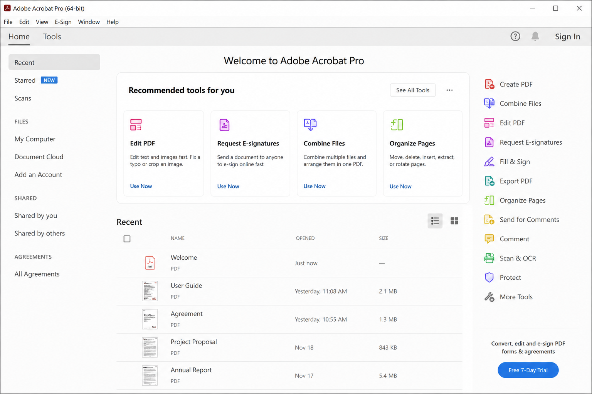
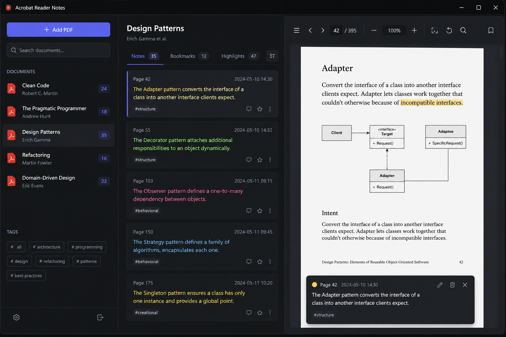

<div align="center"> 

# Acrobat Reader Notes


<br>

### AI-powered PDF annotation manager for researchers, students, and developers.

<p align="center">
  
  
  
  
  <a href="https://github.com/yourusername/acrobat-reader-notes/releases">
    
  </a>

  

</p>

---

> AI-powered PDF annotation manager for researchers, students, and developers.

Acrobat Reader Notes is an open-source platform for importing, organizing, searching, and syncing PDF annotations from Adobe Acrobat Reader and other PDF tools.

</div>

---
<div align="center"> 

## ✨ Features


| 📄 PDF Import             | 🔍 Smart Search            | 🧠 AI Summary           |
| ------------------------- | -------------------------- | ----------------------- |
| Import highlights & notes | Semantic annotation search | Automatic PDF summaries |

| ☁️ Cloud Sync       | 📝 Markdown Export          | 🌐 Offline-first      |
| ------------------- | --------------------------- | --------------------- |
| Sync across devices | Export to Obsidian & Notion | Fully offline support |

</div>

---

### 📄 PDF Annotation Import

Import and process:

* Highlights
* Comments
* Bookmarks
* Handwritten notes
* Text annotations

Supported PDF readers:

* Adobe Acrobat Reader
* Foxit Reader
* PDF-XChange

---

### 🔍 Smart Search

Advanced search system:

* Full-text search
* Semantic AI search
* Search by tags
* Search by document
* Search by annotation type

---

### 🧠 AI Features

Powered by OpenAI embeddings and RAG architecture.

Features include:

* AI-generated summaries
* Semantic document understanding
* Related note suggestions
* Citation extraction

---

### 📝 Markdown Export

Export annotations into clean Markdown format.

Instance:

```md
# PDF Title

## Page 12
> Important quote

User comment
```

Compatible with:

* Obsidian
* Notion
* GitHub
* Markdown editors

---

### 🌐 Cloud Sync

Sync notes across devices.

Supported providers:

* GitHub
* Dropbox
* Google Drive
* Local-first offline mode

---

### 📊 Workspace Dashboard

Dashboard includes:

* Recent PDFs
* Knowledge graph
* Reading statistics
* Favorite highlights
* Study progress

---
<div align="center"> 

## 🚀 Unique Features

</div>

### AI Summary Generator

Automatically creates summaries for imported PDFs.

### Knowledge Graph

Visualizes relationships between notes and documents.

### Citation Generator

Generates:

* MLA citations
* APA citations
* Chicago citations

### Study Mode

Creates flashcards from highlighted content.

### Offline-first Architecture

The application works fully offline and syncs later.

---


## Frontend

* Next.js 15
* TypeScript
* TailwindCSS
* Shadcn/UI
* Zustand

## Backend

* Node.js
* Fastify
* PostgreSQL
* Prisma ORM

## AI Layer

* OpenAI API
* Embeddings Search
* Vector Database
* RAG Architecture

## PDF Processing

* pdfjs
* pdf-lib
* mupdf

---

<div align="center"> 

# 🖼️ Preview

</div>

<p align="center">
 
  
</p>

---

<div align="center"> 

# 🌟 Why This Project?

</div>

Acrobat Reader Notes combines:

* Modern AI technologies
* Powerful PDF processing
* Developer-friendly architecture
* Offline-first workflow
* Knowledge management tools

Perfect for:

* Researchers
* Students
* Writers
* Developers
* Knowledge workers


---
<div align="center"> 

# 🤝 Contributing
</div>

Contributions are welcome.

Ideas for contribution:

* Add dark mode
* Add EPUB support
* Add OCR support
* Improve mobile UI
* Add plugin integrations

---
<div align="center"> 

# 📜 License

Licensed under the MIT License.


[](https://github.com/user/repo/releases)


